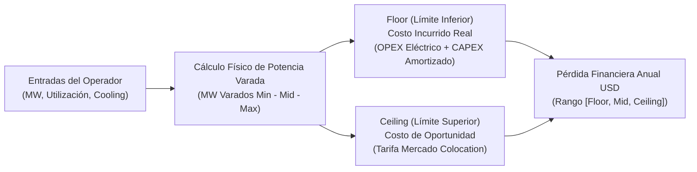

# Metodología y Lógica de Rangos: Stranded Capacity

> **Proyecto:** No Country - Estimación de Capacidad Varada (Stranded Capacity) en Data Centers de IA  
> **Entregable:** 3 - Lógica de Rangos y Cálculo de Límites  
> **Estado:** Documento Oficial de Referencia Metodológica  

---

## 1. ¿Por qué el modelo se expresa como un Rango? (Fundamentación de Negocio y Técnica)

En la gestión e inversión de infraestructura crítica para Inteligencia Artificial y Cómputo de Alta Densidad (HPC), utilizar un valor puntual único o promedios simples genera **falsa precisión**. Los centros de datos reales operan en entornos dinámicos y fuertemente estocásticos. 

Expresar la estimación de *Stranded Capacity* (capacidad pagada y encendida que no produce trabajo computacional útil) como un **intervalo o rango de valores** responde a tres factores de incertidumbre técnica e insumos operativos:

### A. Volatilidad del Entorno Térmico y Frecuencia Dinámica (DVFS)
La eficiencia real de un servidor de IA (ej. clústeres NVIDIA H100/B200) está vinculada al margen térmico disponible y a los algoritmos de escalado de voltaje/frecuencia (DVFS):
* En sistemas **enfriados por aire** (*Air-Cooled*), los procesadores alcanzan temperaturas críticas rápidamente (límites de *throttling* térmico cercanos a 70°C - 75°C), provocando caídas de rendimiento dinámico de hasta **17%** y fluctuación en el consumo eléctrico real del nodo.
* En instalaciones de **refrigeración líquida** (*Direct-to-Chip* o Inmersión), la temperatura de operación se mantiene estable entre 46°C y 54°C, eliminando ventiladores internos del servidor y estabilizando la demanda de potencia.
* Por lo tanto, estimar el desperdicio energético requiere bandas de fluctuación según la resistencia térmica del facility.

### B. Asimetría Geográfica de Costos Eléctricos y de Operación
El impacto económico por Megavatio (MW) varado no es uniforme a nivel global ni regional:
* Los costos energéticos comerciales varían drásticamente (desde $0.06 USD/kWh en regiones de hidroelectricidad o contratos PPA de bajo costo, hasta $0.25+ USD/kWh en zonas metropolitanas de alta demanda).
* Por ejemplo, un rack de alta densidad de 60 kW puede generar un costo de ineficiencia anual de **$51,116 USD** en zonas de bajo costo, frente a **$207,934 USD** en mercados de alto costo energéticos (*"Espiral de Densidad-Costo"*).
* El modelo de rangos permite absorber esta variabilidad geográfica sin perder validez metodológica.

### C. Errores de Telemetría y Cargas "Behind-the-Meter"
En los centros de datos tradicionales enfriados por aire, existe una imperfección estructural en la medición del PUE (*Power Usage Effectiveness*):
* La potencia consumida por los ventiladores internos (*fans*) de los chasis de los servidores frecuentemente se contabiliza dentro del consumo IT, cuando en realidad es un consumo parasitario de enfriamiento.
* El rango contemplado absorbe estas desviaciones de medición en la lectura del PUE nominal vs. el PUE efectivo.

---

## 2. Arquitectura Matemática y Cálculo de Límites (Floor & Ceiling)

Para garantizar que los números de la calculadora sean defendibles ante un Comité de Inversión, CFO o COO, el modelo no define los límites de forma arbitraria. Aplica un marco estricto de **"Suelo y Techo" (Floor & Ceiling)**.



### A. Cálculo de Límites Físicos (Megavatios Varados)

El porcentaje de capacidad varada estructural se deriva de la tecnología de enfriamiento seleccionada y la tasa de utilización declarada:

$$\text{MW Varados} = \text{Capacidad Total (MW)} \times \left( \frac{\text{Pct Stranded}}{100} \right)$$

Donde los rangos de ineficiencia técnica por tecnología son:
* **Air-Cooled (Aire):** Rango de ineficiencia del **12.0% al 13.0%** (Mid: 12.5%).  
  *(Fuente: Microsoft GFS - Sankar & Vaid 2010; Uptime Institute 2024 Global Survey, PUE ref: 1.58)*
* **Hybrid (Híbrido - Aire + Líquido):** Rango de ineficiencia del **8.0% al 10.0%** (Mid: 9.0%).  
  *(Fuente: EIA 2026 Benchmarks, PUE ref: 1.25)*
* **Liquid-Cooled (Líquido Direct-to-Chip / Inmersión):** Rango de ineficiencia del **2.0% al 5.0%** (Mid: 3.5%).  
  *(Fuente: Supermicro AI Benchmark 2025, PUE ref: 1.08)*

> **Ajuste por Baja Utilización:** Si la utilización declarada del facility es inferior al 50%, se suma una penalización progresiva de ineficiencia estructural de $+0.2\%$ por cada punto porcentual por debajo del 50%.

---

### B. Límite Financiero Inferior: Floor (Costo Incurrido Real)

El **Floor (Piso)** representa la pérdida económica **mínima e ineludible** en la que incurre el operador por mantener encendida la infraestructura ociosa. Mide la fuga de dinero directo de la caja operatively.

El Floor combina el costo del flujo eléctrico desperdiciado (**OPEX Energético**) más la depreciación del capital invertido en esa capacidad sin usar (**CAPEX Amortizado**):

$$\text{Loss}_{\text{Floor}} (\text{USD/año}) = \text{OPEX}_{\text{Energía}} + \text{CAPEX}_{\text{Amortizado}}$$

#### 1. OPEX Energético de Potencia Varada:
$$\text{OPEX}_{\text{Energía}} = \text{kW Varados} \times 8760 \text{ horas/año} \times \text{PUE}_{\text{ref}} \times \text{Tarifa Eléctrica (\$/kWh)}$$

#### 2. CAPEX Amortizado:
$$\text{CAPEX}_{\text{Amortizado}} = \frac{\left( \frac{\text{CAPEX por MW}}{1000} \times \text{kW Varados} \right)}{\text{Ciclo de Vida (años)}}$$

*Donde:*
* Tarifa Eléctrica Base = **$0.12 USD / kWh** (EIA 2026 Commercial Rate)
* Ciclo de Vida del Hardware / Infraestructura = **4.5 años**
* CAPEX por MW según tecnología:
  - Aire: **$11,000,000 USD / MW**
  - Híbrido: **$13,500,000 USD / MW**
  - Líquido: **$17,500,000 USD / MW**

---

### C. Límite Financiero Superior: Ceiling (Costo de Oportunidad de Mercado)

El **Ceiling (Techo)** representa la pérdida financiera **máxima teórica o costo de oportunidad**. Responde a la pregunta: *"¿Cuánto dinero dejó de ingresar el data center por no haber comercializado o alquilado esa capacidad en el mercado de Colocation de Alta Densidad?"*.

$$\text{Loss}_{\text{Ceiling}} (\text{USD/año}) = \text{kW Varados} \times \text{Tarifa Colocation (\$/kW/mes)} \times 12 \text{ meses}$$

*Donde:*
* Tarifa de Referencia de Mercado de Colocation = **$184.00 USD / kW / mes** ($2,208 USD / kW / año)  
  *(Fuente: Nlyte Software & Colocation Market Benchmarks 2025/2026)*

---

### D. Estimación Central (Mid / Valor Esperado)

El valor central sugerido para la toma de decisiones generales se define como el promedio aritmético entre el costo incurrido (Floor) y el costo de oportunidad (Ceiling):

$$\text{Loss}_{\text{Mid}} = \frac{\text{Loss}_{\text{Floor}} + \text{Loss}_{\text{Ceiling}}}{2}$$

---

## 3. Rangos Estocásticos y Percentiles de Confianza (Monte Carlo)

Además de los límites determinísticos (Floor/Ceiling), el modelo soporta un análisis estocástico mediante simulación de Monte Carlo (10,000 iteraciones), muestreando distribuciones de probabilidad para el PUE, tarifas de energía y CAPEX.

Esto genera percentiles de confianza para las pérdidas financieras anuales:

| Percentil | Interpretación Operativa | Significado Financiero |
| :--- | :--- | :--- |
| **P10 (Suelo Estocástico)** | Escenario Optimista (10% de probabilidad de ser menor) | Refleja un facility con tarifas eléctricas bajas y PUE altamente optimizado. |
| **P50 (Mediana Estocástica)** | Escenario Base / Probable (50% de probabilidad) | Estimación estocástica central idónea para presupuestación anual. |
| **P90 (Techo Estocástico)** | Escenario Conservador / Pesimista (90% de probabilidad) | Contempla picos de tarifas eléctricas, PUE degradado o sobrecostos de capital. |

---

## 4. Matriz Comparativa y Reglas de Decisión Ejecutiva

Para guiar la acción del operador de la calculadora, el rango proporciona señales claras de priorización:

```
[ Floor (Costo Incurrido) ] -------------- [ Mid (Valor Base) ] -------------- [ Ceiling (Colocation Techo) ]
      $ (OPEX + CAPEX)                        Pérdida Esperada                     Costo Oportunidad $184/kW
```

### Regla de Decisión Económica:
1. **Regla del 20% de Margen:** Cualquier ineficiencia interna que eleve el costo del Floor por encima del **80% del Ceiling** invalida la justificación económica de mantener infraestructura propia (*Build vs. Buy*).
2. **Priorización de Remedación:** Si la pérdida del Floor supera el costo de implementar software de optimización/DCIM ($75,000 USD/MW), el retorno de inversión (ROI) ocurrirá típicamente en **menos de 12 meses**.

---

## 5. Resumen de Supuestos y Fuentes

| Parámetro | Valor Utilizado | Fuente Principal |
| :--- | :--- | :--- |
| **PUE Aire Tradicional** | 1.58 | Uptime Institute Global Data Center Survey 2024 |
| **PUE Híbrido** | 1.25 | Industry Hybrid Benchmark 2025/2026 |
| **PUE Refrigeración Líquida** | 1.08 | Supermicro High-Density AI Benchmark 2025 |
| **Inercia / Stranded Pct Aire** | 12.0% - 13.0% | Microsoft GFS (Sankar & Vaid 2010) |
| **Inercia / Stranded Pct Líquido** | 2.0% - 5.0% | Supermicro Direct-to-Chip Benchmark 2025 |
| **Tarifa Eléctrica Base** | $0.12 USD / kWh | U.S. EIA Commercial Electricity Rates 2026 |
| **Tarifa Colocation Techo** | $184.00 USD / kW / mes | Colocation Market Benchmark 2025/2026 |
| **Ciclo Amortización CAPEX** | 4.5 años | Estándar de Depreciación de Hardware de IA |
| **Costo Remedación DCIM** | $75,000 USD / MW | Estimación de Mercado Implementación DCIM/AI Telemetry |
