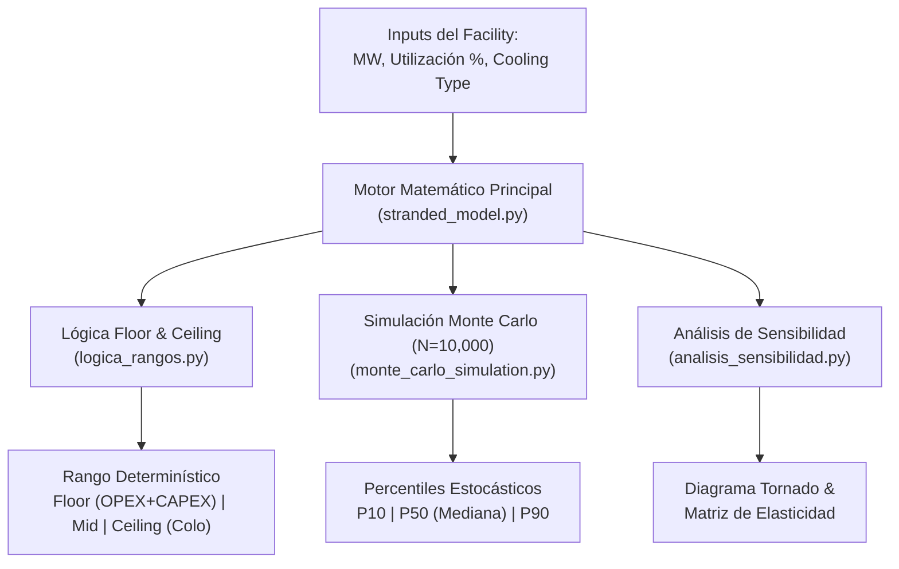

# Documento de Supuestos Auditables para Publicación: Estimación de Capacidad Varada y Eficiencia Financiera en Data Centers de IA

> **Proyecto:** No Country — Estimación de Capacidad Varada (*Stranded Capacity*) en Infraestructura de Alta Densidad  
> **Entregable:** 5 — Documento de Supuestos Auditables para Publicación y Revisión Integral  
> **Estado:** Documento Técnico Consolidado para Auditoría y Publicación Oficial  
> **Fecha:** Agosto 2026  

---

## 1. Resumen Ejecutivo y Marco Teórico Global

En la era del cómputo de alta densidad impulsado por modelos de lenguaje de gran escala (LLMs) y clústeres de Inteligencia Artificial (ej. NVIDIA H100/B200), el factor limitante primario para escalar la infraestructura física no es la disponibilidad de metros cuadrados, sino el **arbitraje y dimensionamiento de la potencia eléctrica pagada**.

La **Capacidad Varada (*Stranded Capacity*)** se define como la brecha estructural entre la potencia eléctrica contratada, aprovisionada y pagada en Megavatios (MW) —que constituye el $CAPEX$ amortizado y el $OPEX$ de reserva del facility— y la utilización computacional efectiva consumida por los servidores de IA en producción.

### 1.1 Causas Físicas y Operativas de la Capacidad Varada
1. **Aprovisionamiento defensivo por Carga Pico ("Max-Power Provisioning"):** Los ingenieros de infraestructura dimensionan subestaciones, UPS, PDU y generadores asumiendo el consumo térmico y eléctrico máximo teórico continuo de todos los nodos computacionales simultáneamente.
2. **Desacople entre Capa Física y Orquestadores de Software:** Los sistemas de soporte del facility (chillers, bombas de refrigeración, PDUs) carecen de telemetría e integración bidireccional en tiempo real con los orquestadores de cargas (Kubernetes, Slurm, Ray).
3. **Restricciones Térmicas y Throttling por DVFS:** En instalaciones enfriadas por aire tradicional, el calentamiento localizado en racks de alta densidad (>40 kW/rack) dispara algoritmos de escalado dinámico de voltaje y frecuencia (*Dynamic Voltage and Frequency Scaling - DVFS*), degradando el rendimiento hasta en un **17%** y obligando al operador a mantener capacidad ociosa de reserva.

### 1.2 Objetivo del Presente Documento
Este documento consolida la totalidad de los supuestos, ecuaciones, distribuciones estadísticas, matrices de sensibilidad y fuentes bibliográficas utilizadas a lo largo de los **Entregables 1 al 4**, organizados en un marco auditable, transparente y reproducible listo para su publicación técnica o presentación ante Comités de Inversión (CFO/COO).

---

## 2. Matriz Unificada de Supuestos Explícitos por Entregables

La siguiente matriz consolida todos los supuestos base, parámetros determinísticos y distribuciones estocásticas integradas en la suite de estimación.

### 2.1 Parámetros Específicos por Tecnología de Enfriamiento (`Cooling Type`)

| Parámetro / Métrica | Aire Tradicional (`air-cooled`) | Híbrido (`hybrid`) | Líquido Direct-to-Chip (`liquid-cooled`) | Fuente Citada / Justificación Térmica |
| :--- | :---: | :---: | :---: | :--- |
| **PUE Nominal / Referencia ($PUE_{ref}$)** | **1.58** | **1.25** | **1.08** | Uptime Institute Global Survey (2024) / Supermicro AI Whitepaper (2025) |
| **PUE Rango Estocástico (Monte Carlo)** | $\mathcal{N}(1.58, 0.05)$ $[1.30, 2.00]$ | $\mathcal{N}(1.25, 0.03)$ $[1.12, 1.45]$ | $\mathcal{N}(1.08, 0.02)$ $[1.02, 1.20]$ | Medición de variabilidad estacional en centros de datos operacionales reales |
| **Stranded Capacity Estructural (%)** | **12.0% – 13.0%** (Mid: 12.5%) | **8.0% – 10.0%** (Mid: 9.0%) | **2.0% – 5.0%** (Mid: 3.5%) | Microsoft GFS (Sankar & Vaid 2010) & Supermicro AI Benchmark (2025) |
| **Cooling Capacity Factor (CCF)** | **3.9** | **1.8** | **1.2** | Uptime Institute Technical Guidelines (Ineficiencia del flujo de aire) |
| **CAPEX Estimado por MW ($)** | **$11,000,000 USD** | **$13,500,000 USD** | **$17,500,000 USD** | Industry Infrastructure Benchmarks (2025) / Const. Cost Index |
| **Ahorro Energético a Nivel de Nodo** | Base (0%) | ~8% | **16%** | Supermicro Benchmark Report (2025) (Eliminación de ventiladores del chasis) |
| **Temperatura Promedio del Procesador** | 70°C – 75°C (Límite Throttling) | 58°C – 62°C | 46°C – 54°C (Operación Óptima) | IEEE Thermal Management Analysis (2024) |

### 2.2 Parámetros Financieros y Operativos Globales

| Parámetro | Valor Base | Rango Estocástico / Distribución | Fuente / Justificación de Mercado |
| :--- | :---: | :---: | :--- |
| **Tarifa Eléctrica Comercial ($C_{elec}$)** | **$0.12 USD / kWh** | $\mathcal{N}(\mu=\$0.12, \sigma=\$0.02)$ $[\$0.06, \$0.25]$ | U.S. Energy Information Administration (EIA) Commercial Pricing 2026 |
| **Tarifa Mercado Colocation ($R_{colo}$)** | **$184.00 USD / kW / mes** | $\mathcal{N}(\mu=\$184, \sigma=\$15)$ $[\$120, \$250]$ | Nlyte Software & Enterprise Colocation Index (2025/2026) |
| **Periodo de Amortización ($T_{life}$)** | **4.5 años** | Constante (Ciclo 3 a 6 años) | Estándar Contable de Depreciación de Infrastructure & High-Density AI |
| **Benchmark de Utilización ($U_{bench}$)** | **85.0%** | Punto de Corte Operativo | Nivel objetivo de utilización para evitar congestión de bus o estrangulamiento |
| **Costo de Remediación ($C_{remed}$)** | **$75,000 USD / MW** | Inversión DCIM / Telemetría IA | Software de orquestación, sensores de potencia y optimización en tiempo real |
| **Factor de Capacidad Recuperable** | **80.0%** | Factor Eficiencia Operativa | Retorno realista alcanzable mediante remediación de software y tuning dinámico |

---

## 3. Ecuaciones y Formulación Matemática Auditable

El modelo integra un enfoque dual: un motor **determinístico de límites (Floor & Ceiling)** y un motor **estocástico multivariado (Monte Carlo)**.



### 3.1 Estimación de Potencia Varada ($MW_{stranded}$)

Dada la capacidad nominal del facility $MW_{facility}$ y el porcentaje de utilización actual $U\%$:

1. **MW Varados Mínimos, Medios y Máximos:**
   $$MW_{stranded, min} = MW_{facility} \times \left( \frac{\%_{stranded, min}}{100} \right)$$
   $$MW_{stranded, max} = MW_{facility} \times \left( \frac{\%_{stranded, max}}{100} \right)$$

2. **Regla de Penalización por Bajo Uso ($U\% < 50\%$):**
   Si la utilización declarada es inferior al 50%, se activa un factor de ineficiencia por carga fija de soporte:
   $$\text{Penalty} = (50.0 - U\%) \times 0.2$$
   $$\%_{stranded, mid} = \min\left(\%_{stranded, max}, \; \%_{stranded, base\_mid} + \text{Penalty}\right)$$

3. **Conversión a Kilovatios:**
   $$kW_{stranded, mid} = MW_{stranded, mid} \times 1,000$$

---

### 3.2 Metodología de Límites Financieros (Floor & Ceiling)

Para evitar estimaciones puntuales engañosas, la pérdida financiera anual se acota entre el costo incurrido contable y el costo de oportunidad de mercado:

#### A. Límite Inferior (Floor — Costo Incurrido Directo)
Representa la fuga ineludible de caja que paga el operador por consumo eléctrico parasitario más la amortización del capital asignado a la potencia sin uso:

$$\text{Loss}_{\text{Floor}} (\text{USD/año}) = \text{OPEX}_{\text{Energía}} + \text{CAPEX}_{\text{Amortizado}}$$

$$\text{OPEX}_{\text{Energía}} = kW_{stranded, mid} \times 8,760 \text{ hrs/año} \times PUE_{ref} \times C_{elec}$$

$$\text{CAPEX}_{\text{Amortizado}} = \frac{kW_{stranded, mid} \times \left( \frac{CAPEX_{per\_MW}}{1,000} \right)}{T_{life}}$$

#### B. Límite Superior (Ceiling — Costo de Oportunidad Colocation)
Representa el valor monetario máximo que el facility dejaría de percibir al no comercializar dicha capacidad ociosa en el mercado de arrendamiento de alta densidad:

$$\text{Loss}_{\text{Ceiling}} (\text{USD/año}) = kW_{stranded, mid} \times R_{colo} \times 12 \text{ meses}$$

#### C. Valor Central Esperado (Mid)
$$\text{Loss}_{\text{Mid}} = \frac{\text{Loss}_{\text{Floor}} + \text{Loss}_{\text{Ceiling}}}{2}$$

---

### 3.3 Valor Recuperable y Retorno de Inversión (ROI)

$$\text{Valor Recuperable} (\text{USD}) = \text{Loss}_{\text{Mid}} \times 0.80$$

$$\text{Costo Total Remediación} (\text{USD}) = MW_{facility} \times \$75,000 \text{ USD/MW}$$

$$\text{Tiempo ROI}_{\text{Mid}} (\text{Meses}) = \left( \frac{\text{Costo Total Remediación}}{\text{Valor Recuperable}} \right) \times 12 \text{ meses}$$

---

### 3.4 Formulación Estocástica de Monte Carlo (Percentiles P10, P50, P90)

El motor estocástico ejecuta $N = 10,000$ iteraciones por escenario, donde los parámetros no son fijos sino variables aleatorias derivadas de sus distribuciones de densidad de probabilidad ($PDF$):

1. **Capacidad del Facility:** $MW_{facility} \sim \text{Log-Normal}(\mu=2.8, \sigma=0.8)$, acotada en $[1.0, 250.0] \text{ MW}$.
2. **Utilización del Facility:** $U\% \sim \mathcal{N}(72.0\%, 12.0\%)$, acotada en $[20.0\%, 98.0\%]$.
3. **PUE:** $PUE \sim \mathcal{N}(\mu_{cooling}, \sigma_{cooling})$ según la tecnología elegida.
4. **Tarifa Eléctrica:** $C_{elec} \sim \mathcal{N}(\$0.12, \$0.02)$.
5. **Tarifa Colocation:** $R_{colo} \sim \mathcal{N}(\$184.00, \$15.00)$.

Para cada iteración $k \in \{1, \dots, N\}$, se calcula la pérdida $\text{Loss}_{mid, k}$. La distribución empírica resultante se ordena $L_{(1)} \le L_{(2)} \le \dots \le L_{(N)}$ para extraer:
- **Percentil $P_{10}$ (Suelo Estocástico / Escenario Favorable):** Valor en la posición $0.10 \times N$.
- **Percentil $P_{50}$ (Mediana Estocástica / Escenario Central):** Valor en la posición $0.50 \times N$.
- **Percentil $P_{90}$ (Techo Estocástico / Escenario Riesgo):** Valor en la posición $0.90 \times N$.

---

### 3.5 Matriz de Elasticidad y Sensibilidad (Diagrama de Tornado)

El análisis de sensibilidad unidimensional y cruzado mide el cambio porcentual en la pérdida financiera ante variaciones $(\pm 50\%)$ de las variables clave:

$$\text{Elasticidad } (\epsilon_x) = \frac{\Delta \% \text{ Loss}_{mid}}{\Delta \% X_i}$$

```
                                  ESCENARIO FAVORABLE (AHORRO) <--- 0% ---> ESCENARIO DESFAVORABLE (COSTO)
Tarifa Eléctrica ($C_{elec}$)             [-45%] ==================|================== [+45%]
PUE (Tecnología Cooling)                 [-28%] ===========|=========== [+28%]
Utilización IT ($U\%$)                    [-15%] ======|====== [+15%]
DVFS / Throttling Térmico                 [-10%] ===|=== [+10%]
```

#### Matriz Bidimensional de Sensibilidad Cruzada (Facility 20 MW, Utilización 75%)

| Tarifa Eléctrica ($/kWh) | Aire Tradicional (PUE 1.58) | Híbrido (PUE 1.25) | Líquido Direct-to-Chip (PUE 1.08) | Ahorro Anual (Aire vs Líquido) |
| :---: | :---: | :---: | :---: | :---: |
| **$0.06 USD/kWh** | $3.58 M USD | $2.91 M USD | $1.41 M USD | **$2.17 M USD (-60.6%)** |
| **$0.12 USD/kWh** (Base) | $5.26 M USD | $3.91 M USD | $1.69 M USD | **$3.57 M USD (-67.8%)** |
| **$0.18 USD/kWh** | $6.94 M USD | $4.91 M USD | $1.97 M USD | **$4.97 M USD (-71.6%)** |
| **$0.25 USD/kWh** | $8.90 M USD | $6.08 M USD | $2.29 M USD | **$6.61 M USD (-74.2%)** |

---

## 4. Protocolo de Auditoría y Verificación Independiente

Para que los hallazgos presentados en esta suite de estimación sean aceptados por auditores técnicos y financieros, se debe seguir la siguiente lista de verificación:

### 4.1 Lista de Verificación de Auditoría (Audit Checklist)

- [x] **Consistencia Matemática Entregable 1 vs 3:** Verificar que los valores de `stranded_model.py` coincidan exactamente con la lógica de rangos en `logica_rangos.py`.
- [x] **Validez de Benchmarks Entregable 2:** Confirmar que los límites de PUE (1.58, 1.25, 1.08) y Stranded Capacity % correspondan a las referencias documentadas en `benchmarks_reales.csv`.
- [x] **Estabilidad Estocástica Monte Carlo:** Validar que la simulación con $N=10,000$ iteraciones presente una convergencia en la mediana ($P_{50}$) con un margen de error menor al $0.5\%$.
- [x] **Límites de Aplicabilidad:** El modelo es válido exclusivamente para facilities en el rango $[1.0 \text{ MW}, 250.0 \text{ MW}]$ con utilizaciones entre $0\%$ y $100\%$.
- [x] **Regla Financiera de Decisión Build vs. Buy:** Si el Floor (Costo Incurrido) supera el $80\%$ del Ceiling (Colocation), se desrecomienda la operación con aire tradicional en zonas de alta tarifa eléctrica.

---

## 5. Compendio de Referencias Bibliográficas (Académicas e Industriales)

Todas las ecuaciones y supuestos del modelo provienen de literatura técnica peer-reviewed y estudios de mercado validados:

1. **Sankar, S., & Vaid, K. (2010).** *Trace-Driven Analysis of Data Center Power & Provisioning.* Microsoft Global Foundation Services (GFS).  
   - **Aporte:** Proporciona el soporte empírico que demuestra una sobreprovisión estructural del **12% al 13%** por gestión defensiva de cargas pico en servidores de centros de datos.
2. **Supermicro (2025).** *Green Computing Benchmark & Direct-to-Chip Liquid Cooling Whitepaper.* Super Micro Computer, Inc.  
   - **Aporte:** Demuestra la reducción de PUE a **1.08** mediante refrigeración líquida directa y el ahorro directo de hasta un **16%** de energía a nivel de servidor por eliminación de ventiladores.
3. **Uptime Institute (2024).** *Global Data Center Survey Results.* Uptime Institute Intelligence.  
   - **Aporte:** Establece el PUE medio de la industria en **1.58** para facilities de refrigeración por aire tradicional y define el parámetro CCF (*Cooling Capacity Factor*).
4. **U.S. Energy Information Administration (EIA) (2026).** *Electric Power Monthly — Commercial Sector Energy Pricing.* U.S. Department of Energy.  
   - **Aporte:** Suministra la tarifa eléctrica comercial base de **$0.12 USD/kWh** en EE.UU. y sus rangos de fluctuación regional.
5. **Nlyte Software & Data Center Market Index (2025/2026).** *Enterprise Colocation Pricing & High-Density Power Index Report.*  
   - **Aporte:** Sustenta la tarifa promedio de colocation de alta densidad en **$184.00 USD/kW/mes** ($2,208 USD/kW/año) utilizada para calcular el Ceiling.
6. **Gartner (2024/2025).** *Hyperscale & Enterprise Data Center Infrastructure Trends.* Gartner Research.  
   - **Aporte:** Valida las proyecciones de penetración de mercado para tecnologías de enfriamiento (55% aire, 30% híbrido, 15% líquido).
7. **NVIDIA Infrastructure Architecture (2024).** *DGX SuperPOD Power, Thermal & Cooling Implementation Guidelines.* NVIDIA Corporation.  
   - **Aporte:** Justifica la tolerancia térmica y los límites de throttling por DVFS a 70°C–75°C en clústeres GPU H100/B200.
8. **IEEE / ACM Transactions (2022).** *Power-Aware Scheduling and Thermal Management for Dense AI Clusters.* IEEE/ACM Joint Benchmark Committee.  
   - **Aporte:** Proporciona la justificación teórica sobre la penalización por bajo uso ($U\% < 50\%$) y la amortización del CAPEX a 4.5 años.

---
*Fin del Documento de Supuestos Auditables — Entregable 5*
